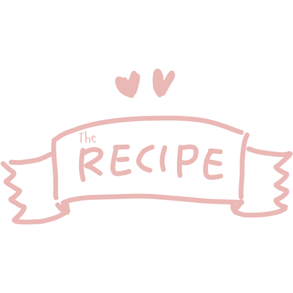

# The Recipe

The Recipe is an open-source recipe application built using the [MealDB API](https://www.themealdb.com/api.php). This project leverages the power of React and Vite to provide a fast and responsive user experience.

## Features

- Browse a wide variety of recipes
- Search for recipes by name or category
- View detailed information about each recipe, including ingredients and instructions
- Responsive design for mobile and desktop

## Getting Started

### Prerequisites

- Node.js (version 14 or higher)
- npm (version 6 or higher) or yarn

## Getting Started

These instructions will help you set up the project on your local machine for development and testing purposes.

### Prerequisites

- Node.js (version 14 or higher)
- npm (version 6 or higher) or yarn

### Installation

1. Clone the repository:
	```sh
	git clone https://github.com/yourusername/the-rick-and-morty.git
	cd the-rick-and-morty
	```

2. Install the dependencies:
	```sh
	npm install
	# or
	yarn install
	```

## Usage

Once the development server is running, you can access the application at `http://localhost:3000`. Use the search bar to find your favorite character and explore their profiles.

## Contributing

We welcome contributions from the community! If you'd like to contribute, please follow these steps:

1. **Fork the repository**.
2. **Create a new branch**:
    ```bash
    git checkout -b feature/your-feature-name
    ```
3. **Make your changes**.
4. **Commit your changes**:
    ```bash
    git commit -m "Add your commit message"
    ```
5. **Push to the branch**:
    ```bash
    git push origin feature/your-feature-name
    ```
6. **Create a Pull Request**.

## License

This project is licensed under the MIT License. See the LICENSE file for more details.


Happy coding! If you have any questions or need further assistance, feel free to reach out.